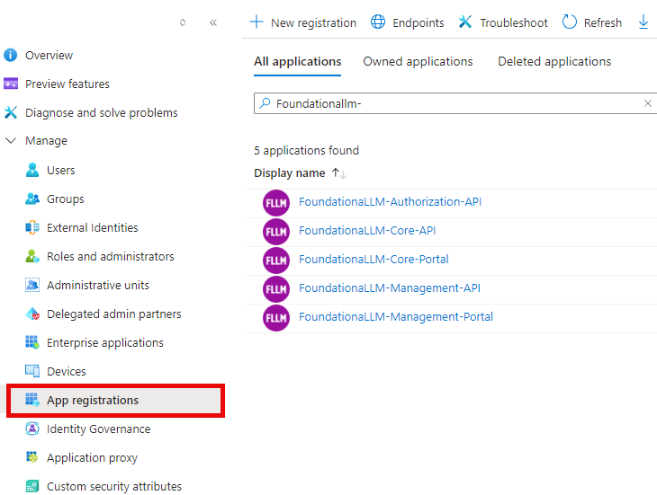
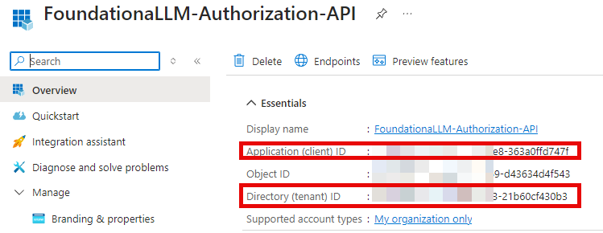
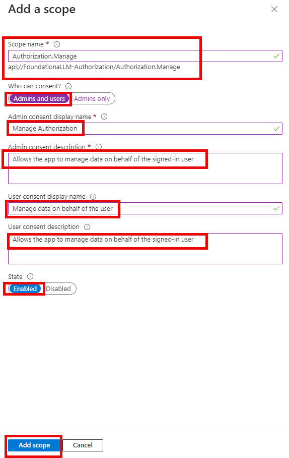

# Authorization setup: Microsoft Entra ID

FoundationaLLM comes with out-of-the-box support for Microsoft Entra ID authorization. This means that you can use your Microsoft Entra ID to setup authorization access to FoundationaLLM's platform.

## Create the Microsoft Entra ID applications

To enable Microsoft Entra ID authorization to the FoundationaLLM platform, you need to register an application in the Microsoft Azure portal Entra ID:

### Pre-requisites

> [!NOTE]
> Make sure you create this App Registration before you run the [deployment scripts](../../deployment/index.md) using `azd up` as you will need some of the generated information during your `azd env set ` calls

#### Setup App Configuration access

1. Sign in to the [Azure portal](https://portal.azure.com/) as at least a Contributor.
2. Navigate to the Resource Group that was created as part of the deployment.
> [!NOTE]
> If you performed an Azure Container Apps (ACA) or Azure Kubernetes Service (AKS) deployment, you will see an extra Resource Group that starts with `ME_` or `MC_` in addition to the Resource Group defined during the deployment. You will need to navigate to the Resource Group that **does not start with** `ME_` or `MC_` to access the App Configuration resource.
3. Select the **App Configuration** resource and select **Configuration explorer** to view the values. If you cannot access the configurations, add your user account as an **App Configuration Data Owner** through Access Control (IAM). You need this role in order to update the configurations as a required part of the authorization setup. To add your user account to the appropriate role, follow the instructions in the [Configure access control for services](../../deployment/configure-access-control-for-services.md#azure-app-configuration-service) document.

### Create the client application

#### Register the client application in the Microsoft Entra ID admin center

1. Sign in to the [Microsoft Entra ID admin center](https://entra.microsoft.com/) as at least a Cloud Application Administrator.
2. Browse to **Identity** > **Applications** > **App registrations**.

    

3. On the page that appears, select **+ New registration**.
4. When the **Register an application** page appears, enter a name for your application, such as *FoundationaLLM-Authorization*. 
5. Under **Supported account types**, select *Accounts in this organizational directory only*.
6. Select **Register**.
7. The application's **Overview** pane displays upon successful registration. Record the **Application (client) ID** and **Directory (tenant) ID** to add to your App Configuration settings later.

    

#### Expose an API for the API application

1. Under **Manage**, select **Expose an API** > **Add a scope**. For **Application ID URI**, accept the default or specify a custom one like `api://FoundationaLLM-Authorization-Auth`, then select **Save and continue**, and then enter the following details:
   - **Scope name**: `Authorization.Manage`
   - **Who can consent?**: **Admins and users**
   - **Admin consent display name**: `Manage Authorization`
   - **Admin consent description**: `Allows the app to manage data on behalf of the signed-in user.`
   - **User consent display name**: `Manage data on behalf of the user`
   - **User consent description**: `Allows the app to manage data on behalf of the signed-in user.`
   - **State**: **Enabled**
2. Select **Add scope** to complete the scope addition.

   

3. Copy the **Scope name** value to add to your App Configuration settings later. For example, it should look something like `api://c79a09ce067141d5832b/Data.Manage`.

   

#### Update the client application manifest

1. Under **Manage**, select **Manifest**.
2. Locate the `accessTokenAcceptedVersion` property and set its value to `2`.

    

3. Select **Save** at the top of the page to save the changes.

### Update App Configuration settings

1. Sign in to the [Azure portal](https://portal.azure.com/) as at least a Contributor.
2. Navigate to the resource group that was created as part of the deployment.
3. Select the **App Configuration** resource and select **Configuration explorer** to view the values.
4. Enter `authorization` in the search box to filter the results.
5. Check the box next to **Key** in the header to select all items.
6. Find the key for `FoundationaLLM:APIs:AuthorizationAPI:APIScope` and click on edit.
7. Replace the value with the value from the scope we created earlier, like `api://FoundationaLLM-Authorization-Auth` 
8. Select **Apply** to save the changes.

## Next steps

Now that Entra authorization is fully configured, navigate to your Entra ID management console and make sure you completed all app registrations for all the other apps mentioned in the deployment documentation.