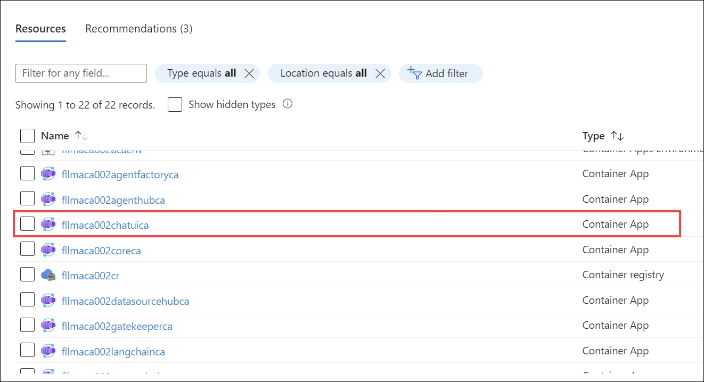
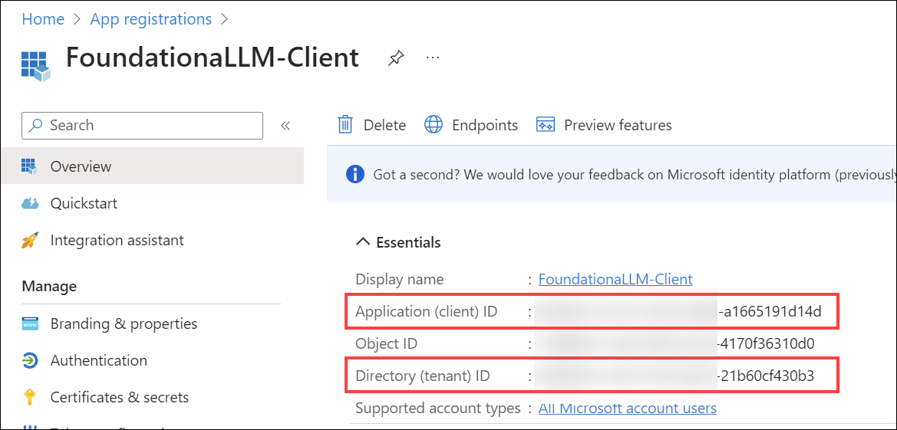
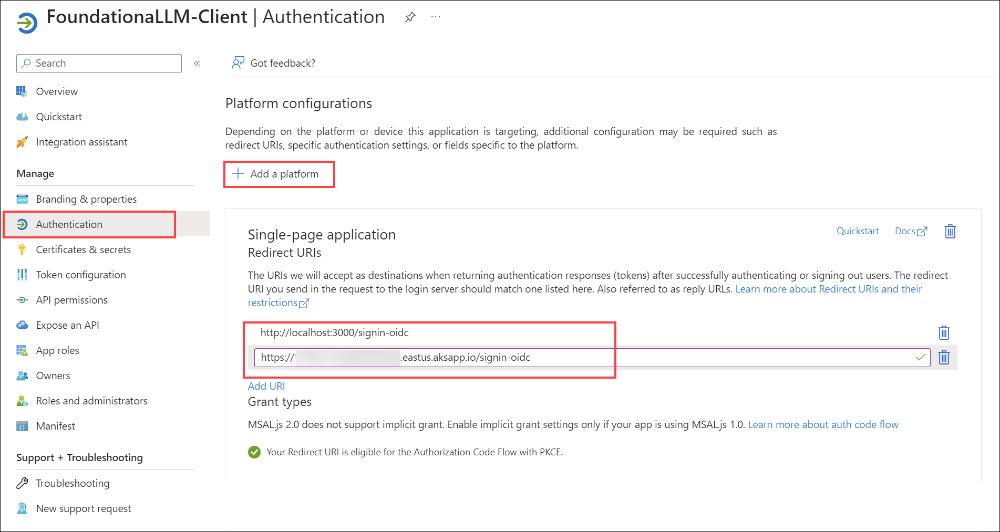
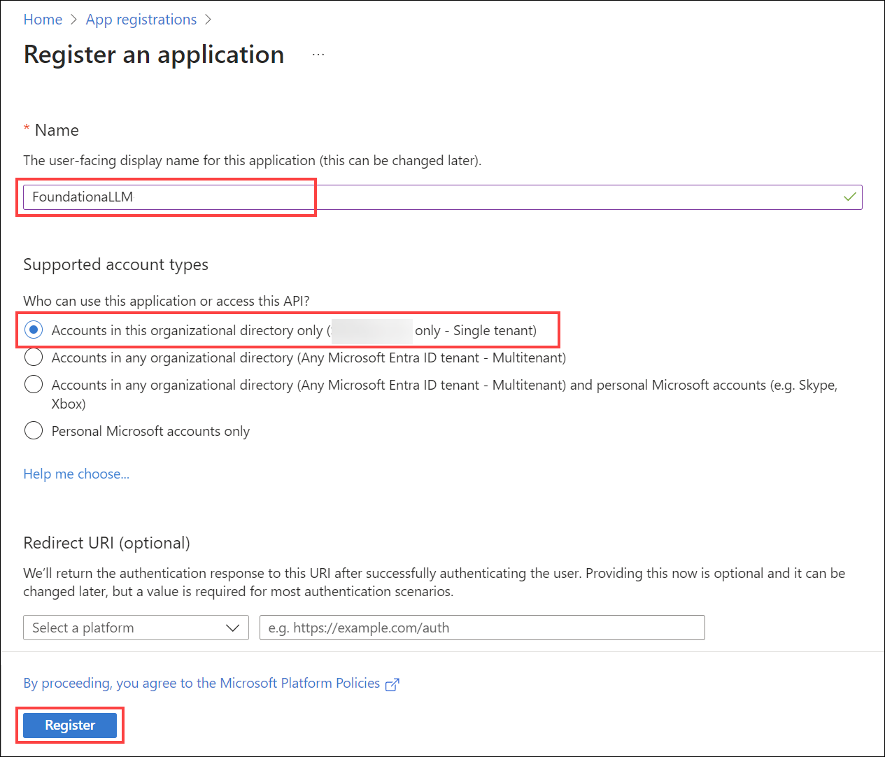
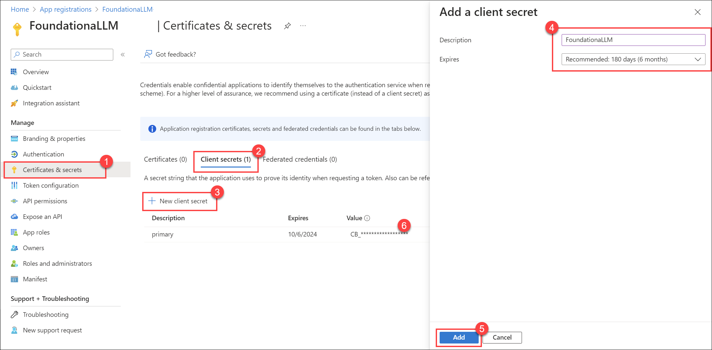

# Authentication setup: Microsoft Entra

FoundationaLLM comes with out-of-the-box support for Microsoft Entra authentication. This means that you can use your Microsoft Entra account to log in to the chat interface.

Table of contents:

- [Authentication setup: Microsoft Entra](#authentication-setup-microsoft-entra)
  - [Creating the Microsoft Entra applications](#creating-the-microsoft-entra-applications)
    - [Pre-requisites](#pre-requisites)
      - [Setup App Configuration access](#setup-app-configuration-access)
      - [Obtain the URL for the chat UI application](#obtain-the-url-for-the-chat-ui-application)
    - [Creating the client application](#creating-the-client-application)
      - [Register the client application in the Microsoft Entra admin center](#register-the-client-application-in-the-microsoft-entra-admin-center)
      - [Add a redirect URI to the client application](#add-a-redirect-uri-to-the-client-application)
      - [Implicit grant and hybrid flows for the client application](#implicit-grant-and-hybrid-flows-for-the-client-application)
      - [Client secret for the client application](#client-secret-for-the-client-application)
    - [Creating the API application](#creating-the-api-application)
      - [Register the API application in the Microsoft Entra admin center](#register-the-api-application-in-the-microsoft-entra-admin-center)
      - [Implicit grant and hybrid flows for the API application](#implicit-grant-and-hybrid-flows-for-the-api-application)
      - [Client secret for the API application](#client-secret-for-the-api-application)
      - [Expose an API for the API application](#expose-an-api-for-the-api-application)
      - [Add authorized client application](#add-authorized-client-application)
    - [Update App Configuration settings](#update-app-configuration-settings)
    - [Update Key Vault secrets](#update-key-vault-secrets)
  - [Next steps](#next-steps)
    - [Restart Core API and Chat UI applications in an ACA Deployment](#restart-core-api-and-chat-ui-applications-in-an-aca-deployment)
    - [Restart Core API and Chat UI applications in an AKS Deployment](#restart-core-api-and-chat-ui-applications-in-an-aks-deployment)

## Creating the Microsoft Entra applications

To enable Microsoft Entra authentication, you need to create two applications in the Microsoft Azure portal:

- A client application that will be used by the chat interface to authenticate users.
- An API application that will be used by the Core API to authenticate users.

### Pre-requisites

> [!NOTE]
> Make sure that you have [deployed the solution](../deployment/deployment-standard.md) before proceeding with the steps below.

#### Setup App Configuration access

1. Sign in to the [Azure portal](https://portal.azure.com/) as at least a Contributor.
2. Navigate to the Resource Group that was created as part of the deployment.
    > [!NOTE]
    > If you performed an Azure Container Apps (ACA) or Azure Kubernetes Service (AKS) deployment, you will see an extra Resource Group that starts with `ME_` or `MC_` in addition to the Resource Group defined during the deployment. You will need to navigate to the Resource Group that **does not start with** `ME_` or `MC_` to access the App Configuration resource.
3. Select the **App Configuration** resource and select **Configuration explorer** to view the values. If you cannot access the configurations, add your user account as an **App Configuration Data Owner** through Access Control (IAM). You need this role in order to update the configurations as a required part of the authentication setup. To add your user account to the appropriate role, follow the instructions in the [Configure access control for services](../deployment/configure-access-control-for-services.md#azure-app-configuration-service) document.

#### Obtain the URL for the chat UI application

You need this URL to assign the redirect URI for the client application.

If you performed an **Azure Container Apps (ACA)** deployment, follow these steps to obtain the URL for the chat UI application:

1. Within the Resource Group that was created as part of the deployment, select the **Container App** resource whose name ends with `chatuica`.

    

2. Within the Overview pane, copy the **Application Url** value. This is the URL for the chat application.

    

If you performed an **Azure Kubernetes Service (AKS)** deployment, follow these steps to obtain the URL for the chat UI application:

1. Within the Resource Group that was created as part of the deployment, select the **Kubernetes Service** resource.

    

2. Select **Properties** in the left-hand menu and copy the **HTTP application routing domain** value. This is the URL for the chat application.

    

### Creating the client application

#### Register the client application in the Microsoft Entra admin center

1. Sign in to the [Microsoft Entra admin center](https://entra.microsoft.com/) as at least a Cloud Application Administrator.
2. Browse to **Identity** > **Applications** > **App registrations**.

    

3. On the page that appears, select **+ New registration**.
4. When the **Register an application** page appears, enter a name for your application, such as *FoundationaLLM-Client*. You should indicate that this is for the client application by appending *-Client* to the name.
5. Under **Supported account types**, select *Accounts in this organizational directory only*.
6. Select **Register**.

    

7. The application's **Overview** pane displays upon successful registration. Record the **Application (client) ID** and **Directory (tenant) ID** to add to your App Configuration settings later.

    

#### Add a redirect URI to the client application

1. Under **Manage**, select **Authentication**.
2. Under **Platform configurations**, select **Add a platform**. In the pane that opens, select **Web**. This is for the Blazor version of the chat application.
3. For **Redirect URIs**, enter `<YOUR_CHAT_APP_URL>/signin-oidc`, replacing `<YOUR_CHAT_APP_URL>` with the chat UI application URL obtained in the [Pre-requisites](#pre-requisites) section above. For example, it should look something like `https://d85a09ce067141d5807a.eastus.aksapp.io/signin-oidc` for an AKS deployment, or `https://fllmaca002chatuica.graybush-c554b849.eastus.azurecontainerapps.io/signin-oidc` for an ACA deployment.
4. Add another **Redirect URI** for local development. For **Redirect URIs**, enter `https://localhost:7258/signin-oidc`.
5. Under **Platform configurations**, select **Add a platform**. In the pane that opens, select **Single-page application**. This is for the Vue.js version of the chat application.
6. Add a **Redirect URI** under Single-page application for your deployed Vue.js application. Enter `<YOUR_CHAT_APP_URL>/signin-oidc`, replacing `<YOUR_CHAT_APP_URL>` with the chat UI application URL obtained in the [Pre-requisites](#pre-requisites) section above. For example, it should look something like `https://d85a09ce067141d5807a.eastus.aksapp.io/signin-oidc` for an AKS deployment, or `https://fllmaca002chatuica.graybush-c554b849.eastus.azurecontainerapps.io/signin-oidc` for an ACA deployment.
7. Add a **Redirect URI** under Single-page application for local development of the Vue.js application: `http://localhost:3000/signin-oidc`.

    

<!-- 8. Under **Front-channel logout URL**, enter `<YOUR_CHAT_APP_URL>/signout-oidc`. -->

#### Implicit grant and hybrid flows for the client application

1. Check **Access tokens** and **ID tokens** under **Implicit grant**.
2. Select **Configure** to apply the changes (if the button is present).
3. Select **Save** at the bottom of the page to save the changes.

    

#### Client secret for the client application

1. Under **Manage**, select **Certificates & secrets**.
2. Under **Client secrets**, select **+ New client secret**.
3. For **Description**, enter a description for the secret. For example, enter *FoundationaLLM-Client*.
4. Select a desired expiration date.
5. Select **Add**.
6. **Record the secret value** to add to your App Configuration settings later. Do this by selecting the **Copy to clipboard** icon next to the secret value.

    

### Creating the API application

#### Register the API application in the Microsoft Entra admin center

1. Return to the [Microsoft Entra admin center](https://entra.microsoft.com).
2. Browse to **Identity** > **Applications** > **App registrations** and select **+ New registration**.

    

3. For **Name**, enter a name for the application. For example, enter *FoundationaLLM*. Users of the app will see this name, and can be changed later.
4. Under **Supported account types**, select *Accounts in this organizational directory only*.
5. Select **Register**.

    

6. The application's **Overview** pane displays upon successful registration. Record the **Application (client) ID** and **Directory (tenant) ID** to add to your App Configuration settings later.

    

#### Implicit grant and hybrid flows for the API application

1. Check **Access tokens** and **ID tokens** under **Implicit grant**.
2. Select **Configure** to apply the changes.
3. Select **Save** at the bottom of the page to save the changes.

    

#### Client secret for the API application

1. Under **Manage**, select **Certificates & secrets**.
2. Under **Client secrets**, select **+ New client secret**.
3. For **Description**, enter a description for the secret. For example, enter *FoundationaLLM*.
4. Select a desired expiration date.
5. Select **Add**.
6. **Record the secret value** to add to your App Configuration settings later. Do this by selecting the **Copy to clipboard** icon next to the secret value.

    

#### Expose an API for the API application

1. Under **Manage**, select **Expose an API** > **Add a scope**. For **Application ID URI**, accept the default or specify a custom one, then select **Save and continue**, and then enter the following details:
   - **Scope name**: `Data.Read`
   - **Who can consent?**: **Admins and users**
   - **Admin consent display name**: `Read data on behalf of users`
   - **Admin consent description**: `Allows the app to read data on behalf of the signed-in user.`
   - **User consent display name**: `Read data on behalf of the user`
   - **User consent description**: `Allows the app to read data on behalf of the signed-in user.`
   - **State**: **Enabled**
2. Select **Add scope** to complete the scope addition.
3. Copy the **Scope name** value to add to your App Configuration settings later. For example, it should look something like `api://d85a09ce067141d5807a/Data.Read`.

#### Add authorized client application

1. While still in the **Expose an API** section, select **+ Add a client application**.
2. Paste the **Application (client) ID** of the client application that you [created earlier](#register-the-client-application-in-the-microsoft-entra-admin-center).
3. Check the `Data.Read` authorized scope that you created.
4. Select **Add application** to complete the client application addition.

### Update App Configuration settings

1. Sign in to the [Azure portal](https://portal.azure.com/) as at least a Contributor.
2. Navigate to the resource group that was created as part of the deployment.
3. Select the **App Configuration** resource and select **Configuration explorer** to view the values.
4. Enter `entra` in the search box to filter the results.
5. Check the box next to **Key** in the header to select all items.
6. Select **Edit** to open a JSON editor for the selected items.

    

7. Replace the values for the following settings with the values that you recorded earlier:
   - `FoundationaLLM:Chat:Entra:ClientId`: The **Application (client) ID** of the client application that you [created earlier](#register-the-client-application-in-the-microsoft-entra-admin-center).
   - `FoundationaLLM:Chat:Entra:Scopes`: The fully-qualified scopes path for the API application that you [created earlier](#expose-an-api-for-the-api-application). For example, it should look something like `api://d85a09ce067141d5807a/Data.Read`.
   - `FoundationaLLM:Chat:Entra:TenantId`: The **Directory (tenant) ID** of the client application that you [created earlier](#register-the-client-application-in-the-microsoft-entra-admin-center).
   - `FoundationaLLM:CoreAPI:Entra:ClientId`: The **Application (client) ID** of the API application that you [created earlier](#register-the-api-application-in-the-microsoft-entra-admin-center).
   - `FoundationaLLM:CoreAPI:Entra:TenantId`: The **Directory (tenant) ID** of the API application that you [created earlier](#register-the-api-application-in-the-microsoft-entra-admin-center).

8. Validate the following values while reviewing the settings:
   - `FoundationaLLM:Chat:Entra:CallbackPath`: Should be `/signin-oidc`.
   - `FoundationaLLM:Chat:Entra:Instance`: Should be `https://login.microsoftonline.com/`.
   - `FoundationaLLM:CoreAPI:Entra:CallbackPath`: Should be `/signin-oidc`.
   - `FoundationaLLM:CoreAPI:Entra:Instance`: Should be `https://login.microsoftonline.com/`.
   - `FoundationaLLM:CoreAPI:Entra:Scopes`: Should be `Data.Read`.

9. Select **Apply** to save the changes.

### Update Key Vault secrets

Key Vault stores the secrets for the client and API applications. You need to update the secrets with the values that you recorded earlier.

1. Return to the [Azure portal](https://portal.azure.com/).
2. Navigate to the resource group that was created as part of the deployment.
3. Select the **Key Vault** resource and select **Secrets**. If you cannot see the secrets, add your user account as a **Key Vault Secrets Officer** through Access Control (IAM). You need this role in order to access the secrets and update them as a required part of the authentication setup.
4. Open the `foundationallm-chat-entra-clientsecret` secret, then select **+ New Version**.
5. Within the **Secret value** field, enter the **Client secret** of the client application that you [created earlier](#client-secret-for-the-client-application), then select **Create**.
6. Open the `foundationallm-coreapi-entra-clientsecret` secret, then select **+ New Version**.
7. Within the **Secret value** field, enter the **Client secret** of the API application that you [created earlier](#client-secret-for-the-api-application), then select **Create**.

## Next steps

Now that Entra authentication is fully configured, restart the Core API and chat applications to apply the changes. Navigate to your chat application or refresh the page if it is already open. It should automatically prompt you to sign in with your Microsoft Entra account.

### Restart Core API and Chat UI applications in an ACA Deployment

To restart the Core API and Chat applications in an Azure Container Apps (ACA) deployment, you will need to navigate to the Core API and Chat applications and restart their container revisions, as indicated in the following Azure Portal screenshot:

   

   1. From the `Revisions` blade in the left navigation panel of the Core API or Chat UI container app detail page in Azure Portal, select the name of the running revision.
   2. A dialog panel titled `Revision details` should appear on the right side of the browser with a `Restart` button at the top.  Select the `Restart` button to restart the running container.

Restarting in this manner will need to be performed for both the Core API container app and the Chat UI container app.

### Restart Core API and Chat UI applications in an AKS Deployment

To restart the Core API and Chat applications in an Azure Kubernetes Service (AKS) deployment, you will need to navigate to the AKS detail page in Azure Portal and perform the following:

   1. Select the `Workloads` blade from the left navigation panel.
   2. Select the `Pods` tab from the `Workloads` detail page.
   3. Select the Core API and Chat UI pods from the list (it helps if you select `default` in the `Filter by namespace` dropdown first).
   4. Select the `Delete` button to terminate the currently running pods.  New pods will be instantiated to take their place.

   