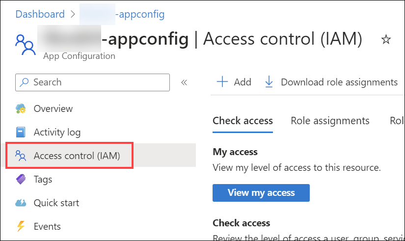
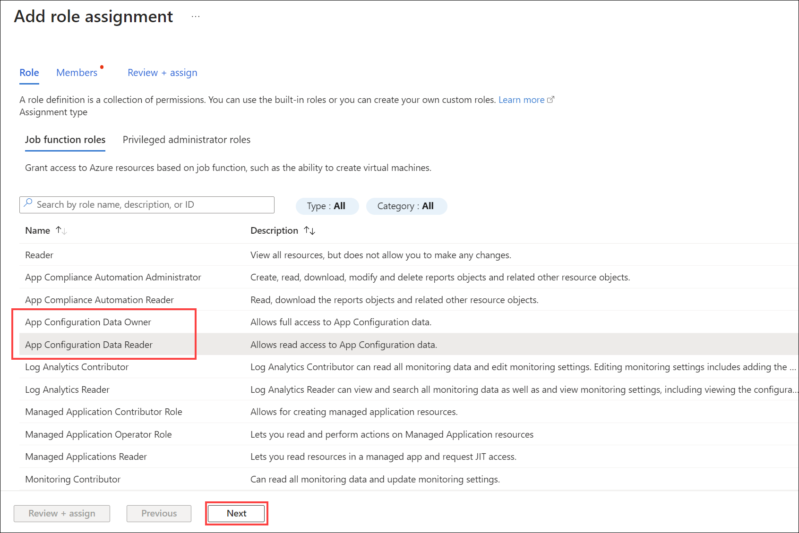
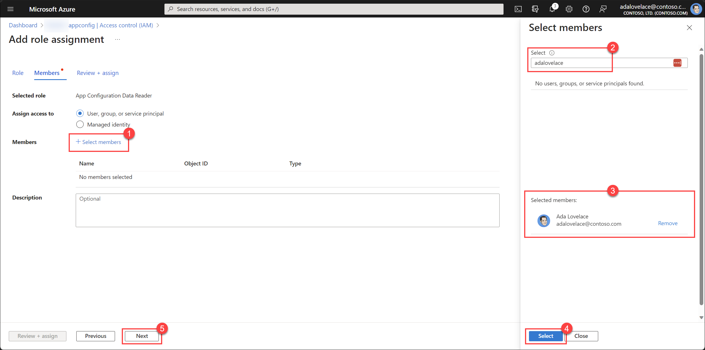
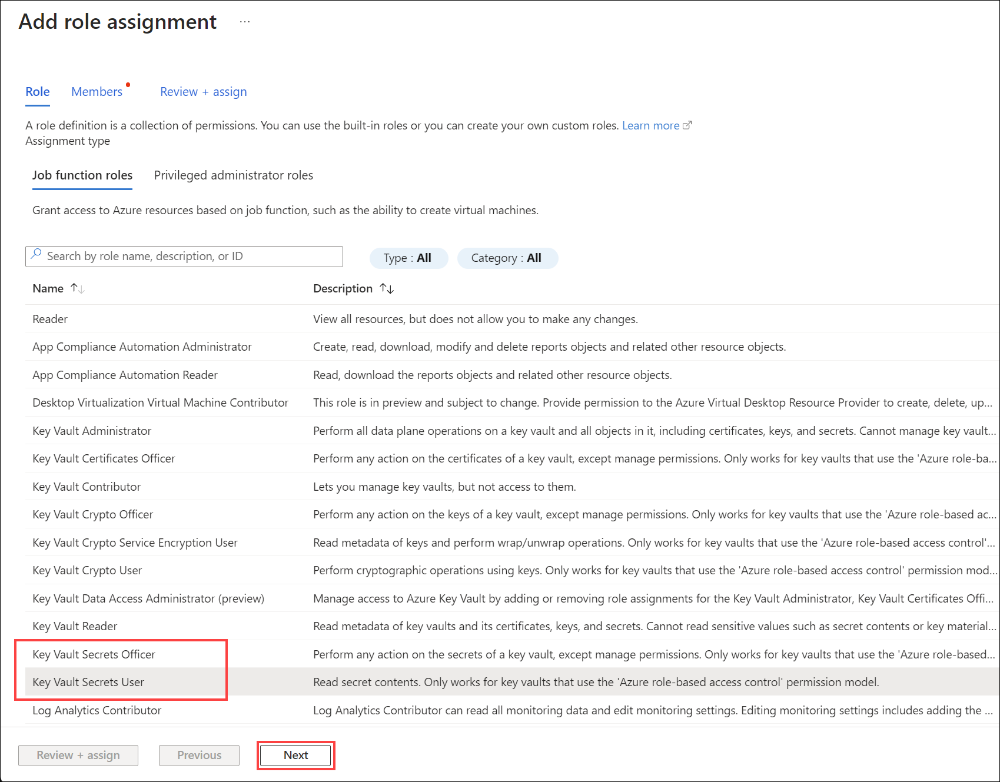
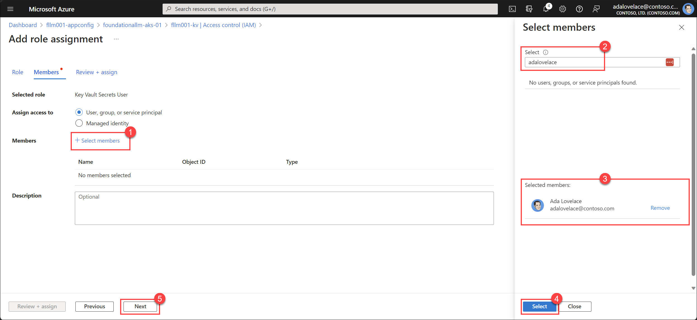

# Configure access control for services

FoundationaLLM takes a least privilege approach to access control. This means that by default, users have no access to any resources. You must explicitly grant access to users for each resource they need to access. This guide walks you through the process of granting access to users as needed.

Table of contents:

- [Configure access control for services](#configure-access-control-for-services)
  - [Prerequisites](#prerequisites)
  - [Azure App Configuration service](#azure-app-configuration-service)
    - [App Configuration roles](#app-configuration-roles)
    - [Grant access to the App Configuration service](#grant-access-to-the-app-configuration-service)
  - [Azure Key Vault service](#azure-key-vault-service)
    - [Key Vault roles](#key-vault-roles)
    - [Grant access to the Key Vault service](#grant-access-to-the-key-vault-service)

## Prerequisites

- You have a FoundationaLLM solution [deployed](deployment-standard.md) and running.
- You have a user account with the `Contributor` role on the Azure resource group or subscription where the solution is deployed.

## Azure App Configuration service

The [Azure App Configuration service](https://learn.microsoft.com/azure/azure-app-configuration/overview) provides FoundationaLLM solution components with a centralized location to store and manage application settings and feature flags. Role-based access controls (RBAC) are used to control access to the App Configuration service for managing settings and feature flags, as well as accessing them. The deployment scripts assign access controls to service accounts to allow them to read application settings and feature flags. You can use the same approach to grant access to users as needed.

### App Configuration roles

The following table summarizes the roles FoundationaLLM uses for the App Configuration service:

Role | Description | Target Users
--- | --- | ---
`App Configuration Data Reader` | Allows users to read settings and feature flags. | The system-assigned managed identities for the `api` services and any developers or admins that need to run the solution locally.
`App Configuration Data Owner` | Allows users to read and write settings and feature flags. | Administrators that need to manage settings and feature flags.

### Grant access to the App Configuration service

Use the steps below to grant access to the App Configuration service:

1. Sign in to the [Azure portal](https://portal.azure.com/) as at least a Contributor.
2. Navigate to the resource group where the solution is deployed.
    > [!NOTE]
    > If you performed an Azure Container Apps (ACA) deployment, you will see an extra Resource Group that starts with `ME_` in addition to the Resource Group defined during the deployment. You will need to navigate to the Resource Group that **does not start with** `ME_` to access the App Configuration resource.
3. Select the **App Configuration** resource. The name should end with `-appconfig`.
4. Select **Access Control (IAM)** in the left-hand menu.

    

5. Select **+ Add** and then **Add role assignment**.

    

6. Select the **App Configuration Data Reader** or the **App Configuration Data Owner** role and then select **Next**.

    

7. Select the **+ Select members** link, search for user or group you want to grant access to, select the member to add them to the _Selected members_ list, and then select **Next**.

    

8. Select **Review + assign** to complete the assignment.

## Azure Key Vault service

The [Azure Key Vault service](https://learn.microsoft.com/azure/key-vault/overview) provides FoundationaLLM solution components with a centralized location to store and manage secrets. Role-based access controls (RBAC) are used to control access to the Key Vault service for managing secrets, as well as accessing them. The deployment scripts assign access controls to service accounts to allow them to read secrets. You can use the same approach to grant access to users as needed.

### Key Vault roles

The following table summarizes the roles FoundationaLLM uses for the Key Vault service:

Role | Description | Target Users
--- | --- | ---
`Key Vault Secrets User` | Allows users to read secrets. | The system-assigned managed identities for the `api` services and any developers or admins that need to run the solution locally.
`Key Vault Secrets Officer` | Allows users to read and write secrets. | Administrators that need to manage secrets.

### Grant access to the Key Vault service

Use the steps below to grant access to the Key Vault service:

1. Sign in to the [Azure portal](https://portal.azure.com/) as at least a Contributor.
2. Navigate to the resource group where the solution is deployed.
    > [!NOTE]
    > If you performed an Azure Container Apps (ACA) deployment, you will see an extra Resource Group that starts with `ME_` in addition to the Resource Group defined during the deployment. You will need to navigate to the Resource Group that **does not start with** `ME_` to access the Key Vault resource.
3. Select the **Key Vault** resource. The name should end with `-kv`.
4. Select **Access Control (IAM)** in the left-hand menu.

    

5. Select **+ Add** and then **Add role assignment**.

    

6. Select the **Key Vault Secrets User** or the **Key Vault Secrets Officer** role and then select **Next**.

    

7. Select the **+ Select members** link, search for user or group you want to grant access to, select the member to add them to the _Selected members_ list, and then select **Next**.

    

8. Select **Review + assign** to complete the assignment.
