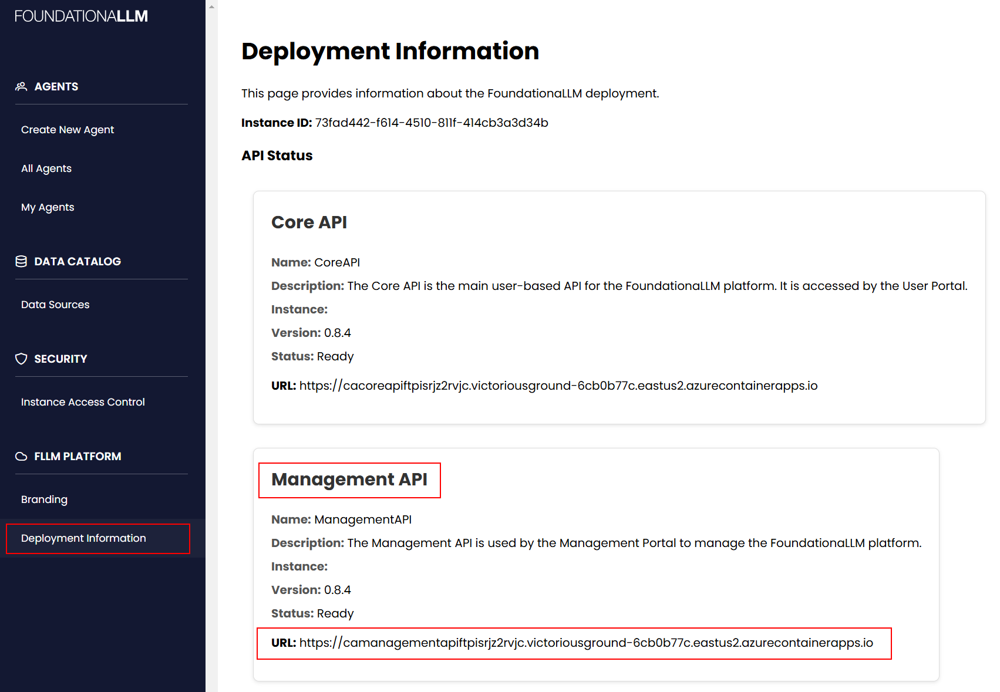

# Automate the management of role assignments for agents

## Calling the Management REST API

All calls to the FoundationaLLM Management REST API must use HTTPS and include the `Authorization` header with a valid Bearer token for the Microsoft Entra ID identity used to perform the call. The token must have the `Data.Manage` scope.

The identity must have one of the following roles assigned at the scope of the FoundationaLLM agent:
- `Owner`
- `User Access Administrator`

The URL of the Management REST API can be obtained from the `Deployment information` section of the FoundationaLLM Management Portal:



Here is an example of how to get an access token for the FoundationaLLM Management REST API:

```cmd
az login
az account get-access-token --scope api://FoundationaLLM-Management/Data.Manage
```

## Listing available agents

To list all agents in your FoundationaLLM instance, you can use the following REST API call:

```
HTTP GET {managementAPIUrl}/instances/{instanceId}/providers/FoundationaLLM.Agent/agents
```

where:
- `{managementAPIUrl}` is the URL of the FoundationaLLM Management REST API.
- `{instanceId}` is the ID of your FoundationaLLM instance.

The response will be a list of objects representing agents. Each object has a property named `resource` that contains the agent's details as follows:

```json
[
    {
        "resource": {
            "type": "knowledge-management",
            "name": "FoundationaLLM",
            "object_id": "/instances/73fad442-f614-4510-811f-414cb3a3d34b/providers/FoundationaLLM.Agent/agents/FoundationaLLM",
            "display_name": null,
            "description": "Useful for answering questions about FoundationaLLM.",
            "cost_center": "",
            "vectorization": {
                "dedicated_pipeline": true,
                "data_source_object_id": "",
                "indexing_profile_object_ids": [
                    ""
                ],
                "text_embedding_profile_object_id": "",
                "text_partitioning_profile_object_id": "",
                "vectorization_data_pipeline_object_id": "",
                "trigger_type": "Event",
                "trigger_cron_schedule": "* * * * *"
            },
            "inline_context": true,
            "sessions_enabled": true,
            "conversation_history_settings": {
                "enabled": false,
                "max_history": 5
            },
            "gatekeeper_settings": {
                "use_system_setting": false,
                "options": []
            },
            "orchestration_settings": {
                "orchestrator": "LangChain",
                "agent_parameters": null
            },
            "prompt_object_id": "/instances/73fad442-f614-4510-811f-414cb3a3d34b/providers/FoundationaLLM.Prompt/prompts/FoundationaLLM",
            "ai_model_object_id": "/instances/73fad442-f614-4510-811f-414cb3a3d34b/providers/FoundationaLLM.AIModel/aiModels/GPT4oMiniCompletionAIModel",
            "capabilities": [
                "OpenAI.Assistants"
            ],
            "tools": {
                "dalle-image-generation": {
                    "name": "dalle-image-generation",
                    "description": "Generates an image based on a prompt.",
                    "ai_model_object_ids": {
                        "main_model": "/instances/73fad442-f614-4510-811f-414cb3a3d34b/providers/FoundationaLLM.AIModel/aiModels/DALLEImageGenerationModel"
                    },
                    "api_endpoint_configuration_object_ids": {},
                    "properties": {}
                }
            },
            "properties": {
                "welcome_message": "<p>You are chatting with an agent named FoundationaLLM, who can answer questions about the FoundationaLLM platform.</p><p>Additional capabilities include:</p><ul><li>Upload files and ask the agent to analyze them</li><li>Generate charts, files, and downloadable content</li><li>Generate images using DALL-E</li></ul><p><em>Please avoid sharing personally identifiable information (PII) while conversing with the agent.</em></p>",
                "Azure.OpenAI.Assistant.Id": "asst_wNLRX3klgprrg6ZFSbigfSJg"
            },
            "created_on": "0001-01-01T00:00:00+00:00",
            "updated_on": "2024-11-13T16:50:28.6257554+00:00",
            "created_by": null,
            "updated_by": "ciprian@foundationaLLM.ai",
            "deleted": false,
            "expiration_date": null
        }
    }
]
```

Make a note of the `object_id` property for the agent you want to assign a role to. You will need this value when requesting to add or remove role assignments for the agent.

## Adding or removing role assignments for an agent

To request adding or removing role assignments for an agent, you can use the following REST API call:

```http
HTTP POST {managementAPIUrl}/instances/{instanceId}/providers/FoundationaLLM.Agent/agents/{agentName}/externalRoleAssignments
```

where:
- `{managementAPIUrl}` is the URL of the FoundationaLLM Management REST API.
- `{instanceId}` is the ID of your FoundationaLLM instance.
- `{agentName}` is the name of the agent you want to assign a role to.

For the example above, the `agentName` would be `FoundationaLLM` and the request should be:

```http
HTTP POST {managementAPIUrl}/instances/73fad442-f614-4510-811f-414cb3a3d34b/providers/FoundationaLLM.Agent/agents/FoundationaLLM/externalRoleAssignments
```

The body of the request should contain the following JSON object:

```json
{
    "roleAssignmentsToAdd": [
        {
            "roleDefinitionId": "00a53e72-f66e-4c03-8f81-7e885fd2eb35",
            "identities": [
                "user1@foundationallm.ai",
                "user2@foundationallm.ai"
            ],
            "expirationDate": "2024-12-31T23:59:59Z"
        }
    ],
    "roleAssignmentsToRemove": [
        {
            "roleDefinitionId": "00a53e72-f66e-4c03-8f81-7e885fd2eb35",
            "identities": []
        }
}
```

where:
- The role definition identifier `00a53e72-f66e-4c03-8f81-7e885fd2eb35` is the well-known identifier for the `Reader` role.
- The `identities` array contains the list of user principal names (UPNs) that you want to assign or remove to or from the role.
- `expirationDate` is an optional property that specifies the date and time when the role assignment will expire.