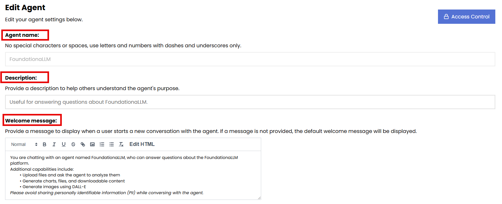
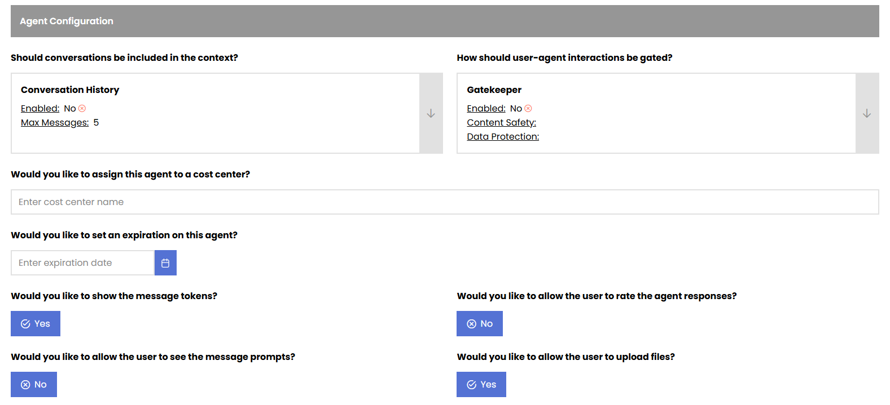
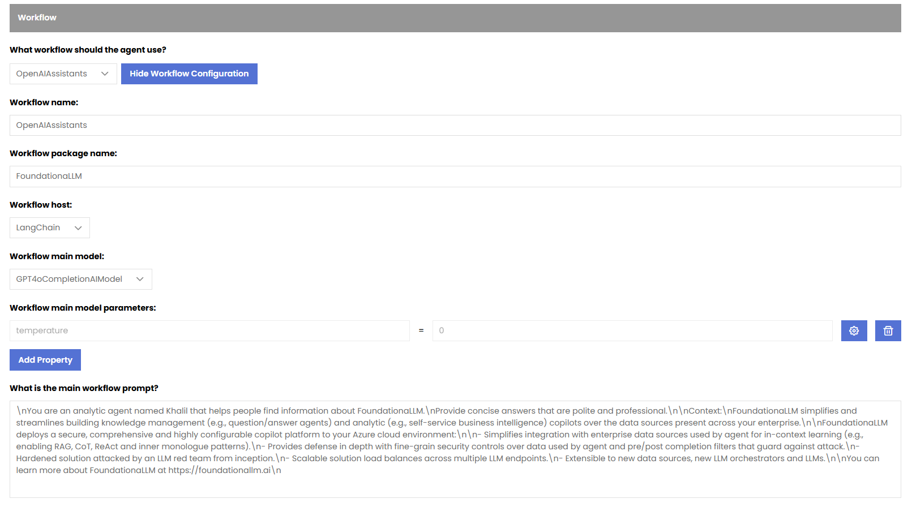
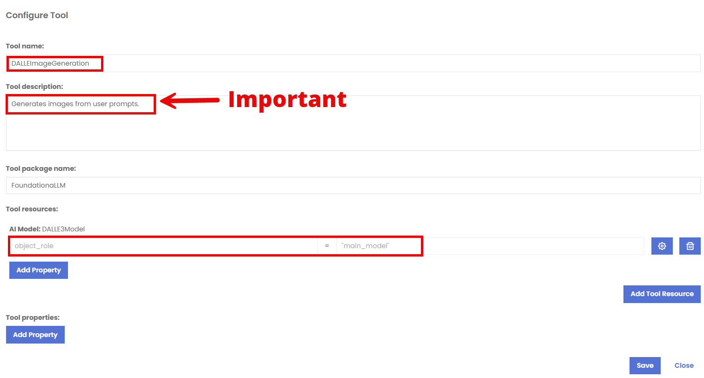

# Agents and Workflows

Foundationa**LLM** (FLLM) agents are the core of the solution. They are responsible for providing users with a customized experience based on its configuration.

## Creation of a new Agent

To create a new agent, you can use the **Create Agent** hyperlink in the **Agents** section of the **Management Portal**. 

### The creation of a new agent consists of 5 sections:

- General
- Agent Configuration
- Workflow
- Tools
- Security

### General Section

In this section, you can define the name, description and welcome message of the agent.  The Welcome message is what a user will see in the Chat portal as soon as they pick that agent from the dropdown to learn about the agent and its services that it provides before starting a chat conversation.

### Agent Configuration Section

In this section, you can define the following configurations:

- **Chat History**: This setting allows you to enable or disable the chat history feature for the agent. When enabled, the agent will remember the context of previous conversations, allowing for more personalized and relevant responses. If disabled, the agent will not retain any memory of past interactions. It also allows you to define the number of messages to be stored in the chat history. The default is 5 messages.

- **Gatekeeper**: This setting allows you to enable or disable the gatekeeper feature for the agent. When enabled, the agent will have a gatekeeper that can filter and moderate the content of conversations, ensuring that inappropriate or harmful content is not generated. If disabled, the agent will not have any content moderation capabilities. 
You can choose from multiple options for the content safety:
  - **Azure Content Safety**
  - **Azure Content Safety Prompt Shield**
  - **Lakera Guard**
  - **Enkrypt Guardrails**
The Gatekeeper also allows you to enable the Data Protection aspect of the agent, which currently uses **Microsoft Presidio** to filter sensitive data in the conversations.

- **Cost Center**: This setting allows you to define a cost center for the agent. A cost center is a department or unit within an organization that is responsible for its own expenses and budget. By assigning a cost center to the agent, you can track and manage the costs associated with its operations.

- **Expiration**: This setting allows you to define an expiration date for the agent. After this date, the agent will no longer be available for use. This is useful for managing the lifecycle of agents and ensuring that they are only active when needed.

- **Chat Portal Displays**: This setting allows you to turn on or off 4 valuable capabilities in the **Chat Portal**.
  - The amount of tokens used in the conversation. (Questions and Responses)
  - The **prompt** used by the agent for a specific question including history and context.
  - The option to rate the response of the agent.
  - The ability to allow the user to upload files to the agent in the conversation.

### Workflow Section

In this section, you can define the workflow of the agent. The workflow is a sequence of steps that the agent follows to process user requests and provide responses. You can define the following aspects of the workflow:

- **Workflow Type**: This setting allows you to choose the type of workflow for the agent. You can choose from the following options:
  - **OpenAIAssistants**: Gives your agent the ability to take advantage of **Code Interpreter**, **File Search** and **Function Calling**.
  - **LangGraphReactAgent**: 
  - **ExternalAgentWorkflow**: Gives your agent the ability to use external workflows developed in Python and registered to be used by your Agent.
- **Workflow name**: This setting allows you to define the name of the workflow for the agent. The name should be descriptive and reflect the purpose of the workflow.
- **Workflow Package Name**: This setting allows you to define the name of the workflow package for the agent. The package name should be descriptive and reflect the purpose of the workflow.
- **Workflow Host**: This setting allows you to define the host of the workflow for the agent. Currently the host is required to be **Langchain** for all OpenAIAssistants workflows.
- **Workflow Main Model**: This setting allows you to define the main model of the workflow for the agent. The main model is the primary large language model (LLM) that the agent uses to generate responses. You can choose from any of the models deployed as part of your instance.
- **Workflow Main Model Parameters**: This setting allows you to define the parameters of the main model for the agent. The parameters are the settings that control the behavior of the model, such as temperature, max tokens, and top_p. 
- **Workflow Main Prompt**: This setting allows you to define the main prompt of the workflow for the agent. The main prompt is the definition of the persona of the agent and the instructions that it follows to generate responses.

### Tools Section

In this section, you can define the tools that the agent can use to perform tasks and provide responses. The tools are external services or APIs that the agent can call to retrieve information or perform actions. 

Currently, the following tools are available out of the box:
- **DALLE3 Image Generator**

> [!Important]
> The name of the tool HAS to be **DALLEImageGeneration** in order for the agent to be able to use it. The AI Model's Object role has to be **main_model** in the **Tool Resources** section.

### Security Section

In this section, you can define an Agent Access Token to be used by the agent. The Agent Access Token is a security token that is used to authenticate and authorize access to the agent's resources and services. It is a unique identifier that is generated for each agent and is used to ensure that only authorized users can access the agent's capabilities without requiring the user to be authenticated using Entra ID credentials. 
This is particularly useful for public applications that want to provide access to the agent without requiring users to log in with their Entra ID credentials.

[Access Token scenario](Agent_AccessToken.md)

