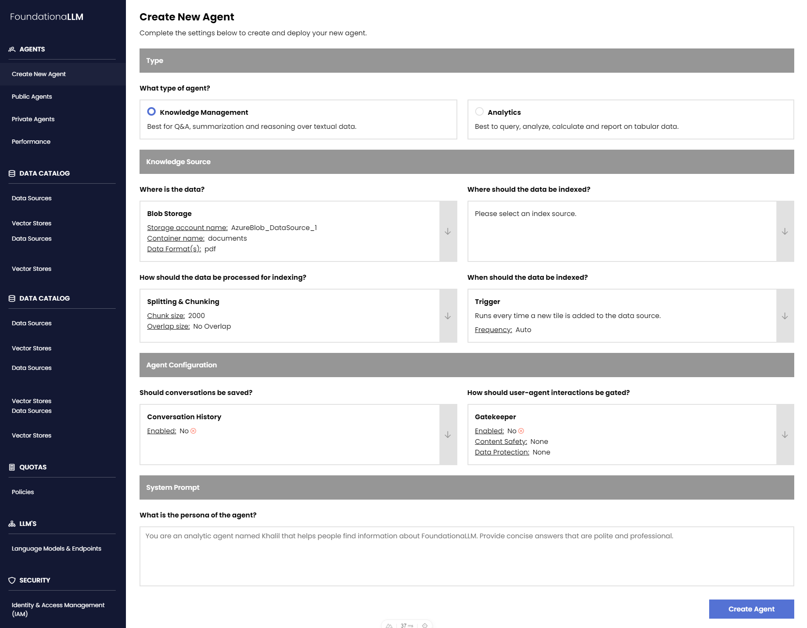
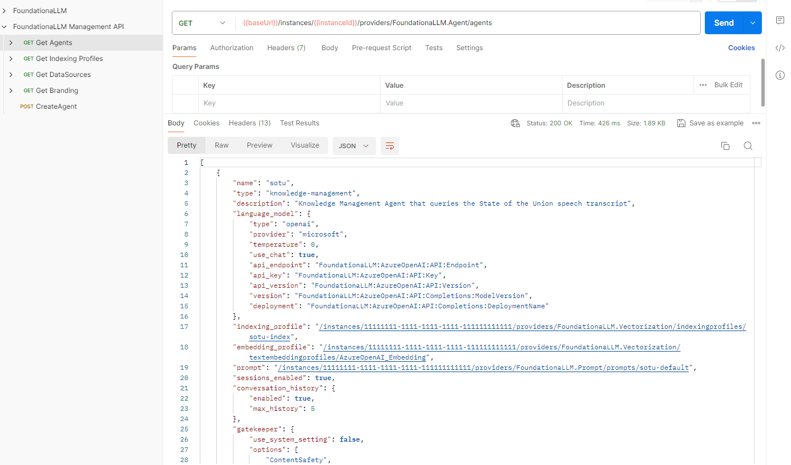

## Management API

Think of the FoundationaLLM Core API as a read only API. It provides a way to query the system for information about agents, users, and other resources. The Management API, on the other hand, is a read-write API. It allows you to create, update, and delete resources in the system.

## Management API Endpoints

The Management API provides configuration and resource management endpoints that can be consumed in the following three ways:
- Direct REST-based calls programmatically or through some tool like Postman.
- Through the Management Portal user interface.
  
- Through the FoundationaLLM CLI.
  
These options eliminate the need to directly manipulate files to define agents and their related resources, enable certain users to update categories of app configurations without needing to have access to the Azure App Configuration service, and perform additional platform-related steps as needed when changing configurations without the user needing to know about them (restart services, refresh caches, etc.).

## Management API Features

In addition to modifying/creating content and platform components, the Management API centralizes health and service monitoring.

Using the Management API from Postman, you can replace the {{baseUrl}} with the actual URL of the Management API resource, and the {{InstanceId}} with the actual instance ID from your app configuration resource that was generated for you.
You can "GET" the configuration of an agent, and "POST" to create a new agent or "PUT" to update an existing agent.