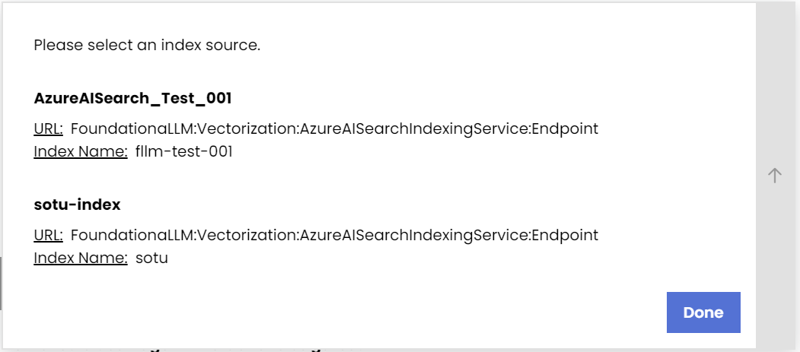

# Management UI

The Management UI enables FLLM administrators to configure agents without directly calling the Management API.

## Creating New Agent

1. Navigate to the **Create New Agent** page using the side navigation bar.
    
    

2. Set the agent type: **Knowledge Management** or **Analytics**.

    

3. Set the agent Knowledge Source:

    

     - On the upper left box, select the correct **Storage account name**, artifacts **Container name**, and agent **Data Format(s)**.
     - Select the upper right box to open the Azure AI Search index dropdown. The vectorized content will be populated in the selected index.

        
     
     - On the lower left box, set the **Chunk size** and **Overlap size** settings for vectorization.
     - On the lower right box, set the vectorization **Trigger** and the trigger **Frequency**.

4. Configure user-agent interactions.

    

    - Enable conversation history using the `Yes/No` Radio Button
    - Configure the Gatekeeper:
        - `Enable/Disable` the Gatekeeper using the Radio Button
        - Set the **Content Safety** platform to either `None` or `Azure Content Safety` using the dropdown menu
        - Set the **Data Protection** platform to either `None` or `Microsoft Presidio` using the dropdown menu

5. Lastly, set the **System Prompt**. The prompt prefixes users' requests to the agent, influencing the tone and functionality of the agent.

    