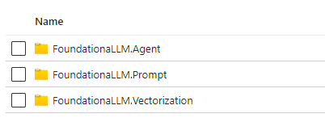
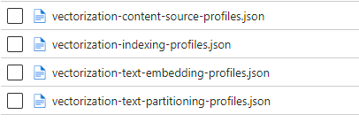

# Resource Management in FoundationaLLM

With the introduction of the Management API, you can now manage resources in FoundationaLLM programmatically or through the Management API User Interface Portal. This includes creating, updating, and deleting resources in the system.

## Resource Providers

The main concept of the Management API is the resource provider. A resource provider is a service that provides resources to the FoundationaLLM system. For example, the agents, prompts and datasources are provided by a resource provider. The Management API provides a way to manage these resources without the need to manually work with JSON files in storage containers and mimics the same concept and functionality of resources in the Azure Portal.

## Resource Provider Structure

The **resource-provider** container in the main storage account that was deployed on your behalf in your subscription contains the following structure:


## Agent References

This first folder **FoundationaLLM.Agent** contains the Agent References.


The content of the **_agent-references** references all the locations of the JSON files that contain the agent information. The **_agent-references** folder contains the following structure:

```json
{
	"AgentReferences": [
		{
			"Name": "sotu-2023",
			"Filename": "/FoundationaLLM.Agent/sotu-2023.json",
			"Type": "knowledge-management"
		},
		{
			"Name": "sotu2",
			"Filename": "/FoundationaLLM.Agent/sotu2.json",
			"Type": "knowledge-management"
		},
		{
			"Name": "sotu3",
			"Filename": "/FoundationaLLM.Agent/sotu3.json",
			"Type": "knowledge-management"
		},
		{
			"Name": "sotu",
			"Filename": "/FoundationaLLM.Agent/sotu.json",
			"Type": "knowledge-management"
		}
	]
}
```

From that starting point for the agent references, we get to point to JSON file that describes each agent available to the system.  Let's start by taking a look at one odf the agents from above called **sotu-2023.json**

```json
{
  "name": "sotu-2023",
  "type": "knowledge-management",
  "object_id": "/instances/1bc45134-6985-48b9-9466-c5f70ddaaa65/providers/FoundationaLLM.Agent/agents/sotu-2023",
  "description": "Knowledge Management Agent that queries the State of the Union speech transcript",
  "indexing_profile": "/instances/1bc45134-6985-48b9-9466-c5f70ddaaa65/providers/FoundationaLLM.Vectorization/indexingprofiles/sotu-index",
  "embedding_profile": "/instances/1bc45134-6985-48b9-9466-c5f70ddaaa65/providers/FoundationaLLM.Vectorization/textembeddingprofiles/AzureOpenAI_Embedding",
  "language_model": {
    "type": "openai",
    "provider": "microsoft",
    "temperature": 0.0,
    "use_chat": true,
    "api_endpoint": "FoundationaLLM:AzureOpenAI:API:Endpoint",
    "api_key": "FoundationaLLM:AzureOpenAI:API:Key",
    "api_version": "FoundationaLLM:AzureOpenAI:API:Version",
    "version": "FoundationaLLM:AzureOpenAI:API:Completions:ModelVersion",
    "deployment": "FoundationaLLM:AzureOpenAI:API:Completions:DeploymentName"
  },
  "sessions_enabled": true,
  "conversation_history": {
    "enabled": true,
    "max_history": 5
  },
  "gatekeeper": {
    "use_system_setting": false,
    "options": [
      "ContentSafety",
      "Presidio"
    ]
  },
  "orchestrator": "LangChain",
  "prompt": "/instances/1bc45134-6985-48b9-9466-c5f70ddaaa65/providers/FoundationaLLM.Prompt/prompts/sotu"
}
```

Notice all the different keys and values that are present to identify the agent. This JSON file is usually created or modifed through the Management API UI Portal or via POST or PUT requests to the Management API using a product like POSTMAN.

The **type** could be "knowledge-management" or "analytical"
The **language-model** section is to identify the provider, its accuracy and endpoints to retrieve from the app configuration resource.
**sessions_enabled** is a boolean to enable or disable the ability to start a session Vs just a one time query using an API tool like Postman.

**conversation_history** is to enable or disable the ability to store the conversation history and the maximum number of conversations to store in case the previous **session_enabled** is set to true.

The **gatekeeper** section is to enable or disable the use of the system settings for content safety and presidio. If set to false, then the options array will be used to identify the specific gatekeepers to use.

The **orchestrator** is the name of the orchestrator to use for the agent. The orchestrator is the component that is responsible for managing the flow of the conversation and the execution of the agent's logic. It could be **LangChain** or **Semantic Kernel** and more options could be used in the future with the growth of the platform and the industry for orchestrators.

The **prompt** is the reference to the prompt that the agent will use to start the conversation. The prompt is a resource that is used to start the conversation with the agent. It is a JSON file that contains the prompt text and the prompt settings.

## Prompt References

The second folder **FoundationaLLM.Prompt** contains the Prompt References.
Within that folder, we have the **_prompt-references** JSON file that contains the following structure:

```json
{
	"PromptReferences": [
		{
			"Name": "sotu5",
			"Filename": "/FoundationaLLM.Prompt/sotu5.json"
		},
		{
			"Name": "sotu-test",
			"Filename": "/FoundationaLLM.Prompt/sotu-test.json"
		},
		{
			"Name": "sotu",
			"Filename": "/FoundationaLLM.Prompt/sotu.json"
		}
	]
}
```
These references point to the JSON files that contain the prompt information. Let's take a look at one of the prompts from above called **sotu5.json** for an example:

```json
{
  "name": "sotu5",
  "type": "prompt",
  "object_id": "/instances/1bc45134-6985-48b9-9466-c5f70ddaaa65/providers/FoundationaLLM.Prompt/prompts/sotu5",
  "description": "Prompt for the Knowledge Management Agent that queries the State of the Union speech transcript",
  "prefix": "You are a political science professional named Baldwin. You are responsible for answering questions regarding the February 2023 State of the Union Address.\nAnswer only questions about the February 2023 State of the Union address. Do not make anything up. Check your answers before replying.\nProvide concise answers that are polite and professional.",
  "suffix": ""
}
```
It contains the name, type of **prompt**, the object_id reference, description and of course most importantly the **prefix** and **suffix** of the prompt. The prefix and suffix are the text that will be used to start and end the conversation with the agent.

## Vectorization References

Finally the third folder **FoundationaLLM.Vectorization** contains the Vectorization References.



Where you will find four important JSON files:
- **vectorization-content-source-profiles.json**
  - This is where all the different types of vectorization profiles are stored.  For example:
```json
  {
    "Profiles": [
        {
            "Type": "AzureDataLake",
            "Name": "SDZWAJournals",
            "ObjectId": "/instances/1bc45134-6985-48b9-9466-c5f70ddaaa65/providers/FoundationaLLM.Vectorization/contentsourceprofiles/SDZWAJournals",
            "Settings": {},
            "ConfigurationReferences": {
                "AuthenticationType": "FoundationaLLM:Vectorization:ContentSources:SDZWAJournals:AuthenticationType",
                "ConnectionString": "FoundationaLLM:Vectorization:ContentSources:SDZWAJournals:ConnectionString"
            }
        },
        {
            "Type": "SharePointOnline",
            "Name": "GSGSharePointOnline",
            "ObjectId": "/instances/1bc45134-6985-48b9-9466-c5f70ddaaa65/providers/FoundationaLLM.Vectorization/contentsourceprofiles/GSGSharePointOnline",
            "Settings": {},
            "ConfigurationReferences": {
                "CertificateName": "FoundationaLLM:Vectorization:ContentSources:GSGSharePointOnline:CertificateName",
                "ClientId": "FoundationaLLM:Vectorization:ContentSources:GSGSharePointOnline:ClientId",
                "KeyVaultURL": "FoundationaLLM:Vectorization:ContentSources:GSGSharePointOnline:KeyVaultURL",
                "TenantId": "FoundationaLLM:Vectorization:ContentSources:GSGSharePointOnline:TenantId"
            }
        },
        {
            "Type": "AzureSQLDatabase",
            "Name": "MSDFAzureSQLDB",
            "ObjectId": "/instances/1bc45134-6985-48b9-9466-c5f70ddaaa65/providers/FoundationaLLM.Vectorization/contentsourceprofiles/MSDFAzureSQLDB",
            "Settings": {},
            "ConfigurationReferences": {
                "ConnectionString": "FoundationaLLM:Vectorization:ContentSources:MSDFAzureSQLDB:ConnectionString"
            }
        }
    ]
}
```

This is where we identify the name and the type of the content source profiles to use for the vectorization of the content. And within the **configurationReferences** section, we identify the specific settings to use for the content source where it could be indexing PDF files, Sharepoint online content or straight from an Azure SQL Database, etc...


- **vectorization-indexing-profiles.json**
```json
{
    "Profiles": [
        {
            "Indexer": "AzureAISearchIndexer",
            "Name": "AzureAISearch_Test_001",
            "ObjectId": null,
            "Settings": {
                "IndexName": "fllm-test-001"
            },
            "ConfigurationReferences": {
                "APIKey": "FoundationaLLM:Vectorization:AzureAISearchIndexingService:APIKey",
                "QueryAPIKey": "FoundationaLLM:Vectorization:AzureAISearchIndexingService:QueryAPIKey",
                "AuthenticationType": "FoundationaLLM:Vectorization:AzureAISearchIndexingService:AuthenticationType",
                "Endpoint": "FoundationaLLM:Vectorization:AzureAISearchIndexingService:Endpoint"
            }
        },
        {
            "Indexer": "AzureAISearchIndexer",
            "Name": "sotu-index",
            "ObjectId": "/instances/1bc45134-6985-48b9-9466-c5f70ddaaa65/providers/FoundationaLLM.Vectorization/indexingprofiles/sotu-index",
            "Settings": {
                "IndexName": "sotu-index",
                "TopN": "3",
                "Filters": "",
                "EmbeddingFieldName": "Embedding",
                "TextFieldName": "Text"
            },
            "ConfigurationReferences": {
                "APIKey": "FoundationaLLM:Vectorization:AzureAISearchIndexingService:APIKey",
                "QueryAPIKey": "FoundationaLLM:Vectorization:AzureAISearchIndexingService:QueryAPIKey",
                "AuthenticationType": "FoundationaLLM:Vectorization:AzureAISearchIndexingService:AuthenticationType",
                "Endpoint": "FoundationaLLM:Vectorization:AzureAISearchIndexingService:Endpoint"
            }
        },
        {
            "Indexer": "AzureAISearchIndexer",
            "Name": "AzureAISearch_MSDF_001",
            "ObjectId": null,
            "Settings": {
                "IndexName": "fllm-msdf-001",
                "TopN": "3",
                "Filters": "",
                "EmbeddingFieldName": "Embedding",
                "TextFieldName": "Text"
            },
            "ConfigurationReferences": {
                "APIKey": "FoundationaLLM:Vectorization:AzureAISearchIndexingService:APIKey",
                "AuthenticationType": "FoundationaLLM:Vectorization:AzureAISearchIndexingService:AuthenticationType",
                "Endpoint": "FoundationaLLM:Vectorization:AzureAISearchIndexingService:Endpoint"
            }
        }
    ]
}
```

This is where we identify the name and the Indexer to use for the indexing of the content. And within the **configurationReferences** section, we identify the APIKey, QueryAPIKey, AuthenticationType and Endpoint to use for the indexing. It could be indexing against the Azure AI Search or any other indexer that is available in the system and more will be supported in the future.

- **vectorization-text-embedding-profiles.json**
```json
{
	"Profiles": [
		{
			"TextEmbedding": "SemanticKernelTextEmbedding",
			"Name": "AzureOpenAI_Embedding",
			"ObjectId": "/instances/1bc45134-6985-48b9-9466-c5f70ddaaa65/providers/FoundationaLLM.Vectorization/textembeddingprofiles/AzureOpenAI_Embedding",
			"Settings": {},
			"ConfigurationReferences": {
				"APIKey": "FoundationaLLM:Vectorization:SemanticKernelTextEmbeddingService:APIKey",
				"APIVersion": "FoundationaLLM:Vectorization:SemanticKernelTextEmbeddingService:APIVersion",
				"AuthenticationType": "FoundationaLLM:Vectorization:SemanticKernelTextEmbeddingService:AuthenticationType",
				"DeploymentName": "FoundationaLLM:Vectorization:SemanticKernelTextEmbeddingService:DeploymentName",
				"Endpoint": "FoundationaLLM:Vectorization:SemanticKernelTextEmbeddingService:Endpoint"
			}
		}
	]
}
```
This is where we identify the name and the Text Embedding to use for the vectorization of the text. And within the **configurationReferences** section, we identify the APIKey, APIVersion, AuthenticationType, DeploymentName and Endpoint to use for the text embedding.

- **vectorization-text-partitioning-profiles.json**
```json
{
	"Profiles": [
		{
			"Name": "DefaultTokenTextPartition",
			"TextSplitter": "TokenTextSplitter",
			"Settings": {
				"Tokenizer": "MicrosoftBPETokenizer",
				"TokenizerEncoder": "cl100k_base",
				"ChunkSizeTokens": "2000",
				"OverlapSizeTokens": "200"
			}
		}
	]
}
```
This is where we identify the name and the Text Splitter to use for the chunking and overlapping of the text.
In the settings section, we identify the tokenizer and the encoder to use for the text partitioning and the chunk size and overlap size in tokens.

## Syncronized Versus Asynchronized Vectorization

The vectorization process can be done in a synchronized or asynchronized manner.  The synchronized manner is when the vectorization process is done in real time **in memory** and the results are returned immediately.  The asynchronized manner is when the vectorization process is done in the background and the results are returned at a later time.  The asynchronized manner is useful when the vectorization process is expected to take a long time to complete and the user does not want to wait for the results.  The asynchronized manner is also useful when the vectorization process is expected to be done in batches and the user does not want to wait for the results of each batch.

For example, you would use syncronized vactorization when you have one or few files that you want to vectorize and you want the results immediately.  You would use asynchronized vectorization when you have hundred or thousands of files that you want to vectorize and you want the results at a later time.