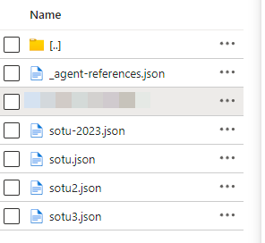

## Resource Management in FoundationaLLM

With the introduction of the Management API, you can now manage resources in FoundationaLLM programmatically or through the Management API User Interface Portal. This includes creating, updating, and deleting resources in the system.

## Resource Providers

The main concept of the Management API is the resource provider. A resource provider is a service that provides resources to the FoundationaLLM system. For example, the agents, prompts and datasources are provided by a resource provider. The Management API provides a way to manage these resources without the need to manually work with JSON files in storage containers and mimics the same concept and functionality of resources in the Azure Portal.

## Resource Provider Structure

The **resource-provider** container in the main storage account that was deployed on your behalf in your subscription contains the following structure:


## Agent References

This first folder **FoundationaLLM.Agent** contains the Agent References.


The content of the **_agent-references** references all the locations of the JSON files that contain the agent information. The **_agent-references** folder contains the following structure:

```json
{
	"AgentReferences": [
		{
			"Name": "sotu-2023",
			"Filename": "/FoundationaLLM.Agent/sotu-2023.json",
			"Type": "knowledge-management"
		},
		{
			"Name": "sotu2",
			"Filename": "/FoundationaLLM.Agent/sotu2.json",
			"Type": "knowledge-management"
		},
		{
			"Name": "sotu3",
			"Filename": "/FoundationaLLM.Agent/sotu3.json",
			"Type": "knowledge-management"
		},
		{
			"Name": "sotu",
			"Filename": "/FoundationaLLM.Agent/sotu.json",
			"Type": "knowledge-management"
		}
	]
}
```

From that starting point for the agent references, we get to point to JSON file that describes each agent available to the system.  Let's start by taking a look at one odf the agents from above called **sotu-2023.json**

```json
{
  "name": "sotu-2023",
  "type": "knowledge-management",
  "object_id": "/instances/1bc45134-6985-48b9-9466-c5f70ddaaa65/providers/FoundationaLLM.Agent/agents/sotu-2023",
  "description": "Knowledge Management Agent that queries the State of the Union speech transcript",
  "indexing_profile": "/instances/1bc45134-6985-48b9-9466-c5f70ddaaa65/providers/FoundationaLLM.Vectorization/indexingprofiles/sotu-index",
  "embedding_profile": "/instances/1bc45134-6985-48b9-9466-c5f70ddaaa65/providers/FoundationaLLM.Vectorization/textembeddingprofiles/AzureOpenAI_Embedding",
  "language_model": {
    "type": "openai",
    "provider": "microsoft",
    "temperature": 0.0,
    "use_chat": true,
    "api_endpoint": "FoundationaLLM:AzureOpenAI:API:Endpoint",
    "api_key": "FoundationaLLM:AzureOpenAI:API:Key",
    "api_version": "FoundationaLLM:AzureOpenAI:API:Version",
    "version": "FoundationaLLM:AzureOpenAI:API:Completions:ModelVersion",
    "deployment": "FoundationaLLM:AzureOpenAI:API:Completions:DeploymentName"
  },
  "sessions_enabled": true,
  "conversation_history": {
    "enabled": true,
    "max_history": 5
  },
  "gatekeeper": {
    "use_system_setting": false,
    "options": [
      "ContentSafety",
      "Presidio"
    ]
  },
  "orchestrator": "LangChain",
  "prompt": "/instances/1bc45134-6985-48b9-9466-c5f70ddaaa65/providers/FoundationaLLM.Prompt/prompts/sotu"
}
```

Notice all the different keys and values that are present to identify the agent. This JSON file is usually created or modifed through the Management API UI Portal or via POST or PUT requests to the Management API using a product like POSTMAN.

The **type** could be "knowledge-management" or "analytical"
The **language-model** section is to identify the provider, its accuracy and endpoints to retrieve from the app configuration resource.
**sessions_enabled** is a boolean to enable or disable the ability to start a session Vs just a one time query using an API tool like Postman.

**conversation_history** is to enable or disable the ability to store the conversation history and the maximum number of conversations to store in case the previous **session_enabled** is set to true.

The **gatekeeper** section is to enable or disable the use of the system settings for content safety and presidio. If set to false, then the options array will be used to identify the specific gatekeepers to use.

The **orchestrator** is the name of the orchestrator to use for the agent. The orchestrator is the component that is responsible for managing the flow of the conversation and the execution of the agent's logic. It could be **LangChain** or **Semantic Kernel** and more options could be used in the future with the growth of the platform and the industry for orchestrators.

The **prompt** is the reference to the prompt that the agent will use to start the conversation. The prompt is a resource that is used to start the conversation with the agent. It is a JSON file that contains the prompt text and the prompt settings.